# Détecter les Bad-Buzz grâce à l'analyse de sentiments

Notre client nous a demandé **de prédire le sentiment associé aux tweets** parlant de sa marque pour détecter les éventuels bad-buzz. L'analyse des sentiments avec deux polarités semblent donc parfaitement adaptée.

---
## Qu'est-ce que l'analyse des sentiments ?

C'est une technique **NLP** qui utilise un modèle d'apprentissage supervisé pour attribuer un *score de sentiment* pondérés aux *éléments* d'un texte *(individuellement ou ensemble)*, pour identifier sa polarité *(**positives** / **neutres** / **négatives** ou autres variantes... )*.

> C'est une approche utile pour:
> - **évaluer l'opinion publique**,
> - **réaliser des études de marché**,
> - **identifier les ressentis clients**,
> - **surveiller la réputation de marques ou produits**.

---
## Préparation des données

Nous avons d'abord analysé le dataset pour en tirer des informations utiles :

>### 1. Distribution de la polarité des tweets
> 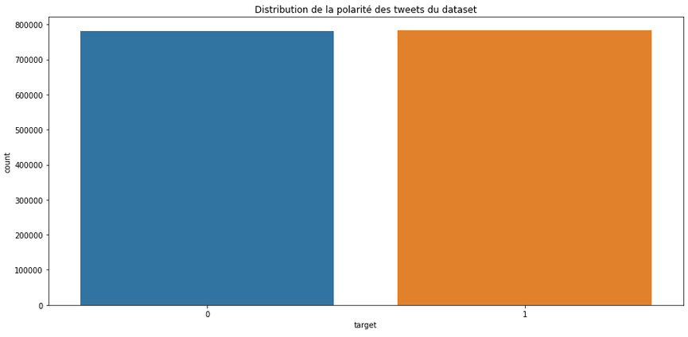 
> le dataset est **parfaitement distribué** entre les deux labels.
>
> ---
>### 2. Distribution de la temporalité des tweets
> 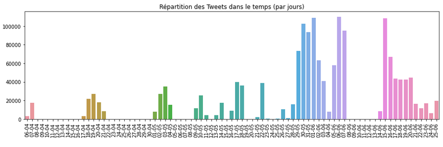 
> **tous les tweets ont été postés en 2009**, ce qui nous permet de déterminer une **limite de 140 caractères**.
>
> ---
>### 3. Distribution des tweets selon leur nombre de caractères
> 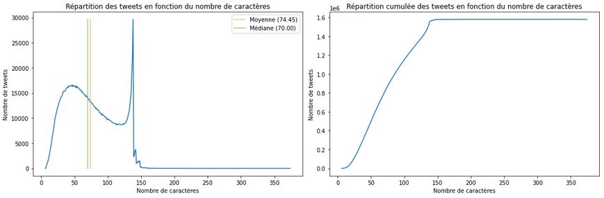 
> certains tweets dépassent la limite des 140 caractères... il a donc fallu chercher pourquoi *(balise HTML et encodages exotiques)* et agir en conséquence.
>
> ---
>### 4. Distribution des tweets selon leur nombre de mots
> 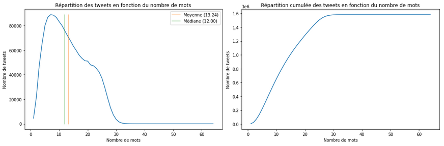 
> le maximum étant de 65, nous pouvons choisir d'appliquer un padding de 65 sur nos séquences pour les harmoniser.

 Puis après la suppression des balises HTML ou des textes toujours trop long après nettoyage, nous avons préparé 8 datasets avec des pré-processing différents:

> `RAW`
> - aucun pré-traitement 
>  

> `PREPROCESS01`
> - nettoyage avec Twitter-preprocessor 
>  

> `PREPROCESS02`
> - nettoyage avec Twitter-preprocessor
> - Tokenization 
>  

> `PREPROCESS03`
> - nettoyage avec Twitter-preprocessor
> - Tokenization
> - Filtrage **avancé** 
>  

> `PREPROCESS03_simple`
> - nettoyage avec Twitter-preprocessor
> - Tokenization
> - Filtrage **simple** 
> 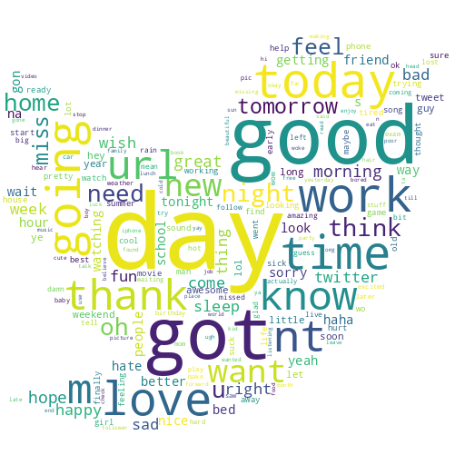 

> `PREPROCESS04`
> - nettoyage avec Twitter-preprocessor
> - Tokenization
> - Filtrage **avancé**
> - Lemmatization 
> 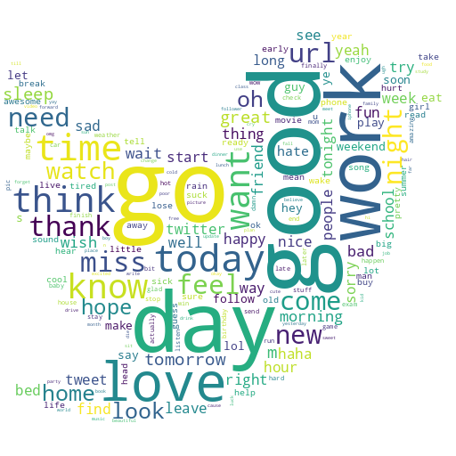 

> `PREPROCESS04_simple`
> - nettoyage avec Twitter-preprocessor
> - Tokenization
> - Filtrage **simple**
> - Lemmatization 
>  

> `PREPROCESS04_nofilter`
> - nettoyage avec Twitter-preprocessor
> - Tokenization
> - AUCUN Filtrage
> - Lemmatization 
>  

---
## Modèle naïf

Nous avons commencé par la mises en place d'un algorithme naïf *(DummyClassifier)* permettant d'établir une base de référence. Pour se faire, nous avons utilisé tous les samples du pré-processing `RAW` sur lesquels nous avons appliqué un **TF-IDF**.

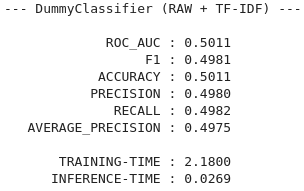
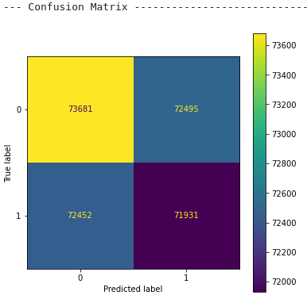
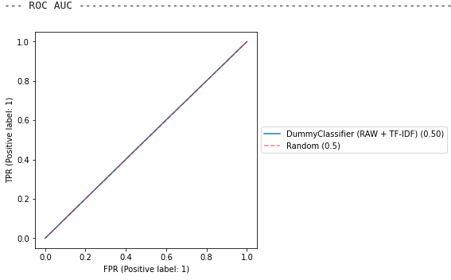

---
## Modèle sur mesure simple

Après avoir établi notre baseline naïve, nous avons entraîné des **régressions logistiques** sur chacun des dataset pré-processés *(avec grid-search pour les hyper-paramètres)*.

Les 8 modèles produits, ont mis en évidence l'**influence négative de la suppression des stop-words**. On peut supposer que leur suppression peut changer le sens des mots *(`I don't like it` --> `I like`)* et donc perturber l'apprentissage.

Voici les résultats avec les samples du pré-processing `RAW` préparés avec **TF-IDF**:

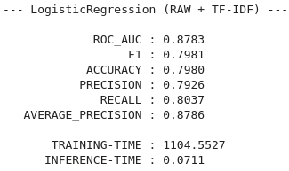
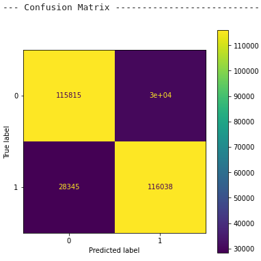
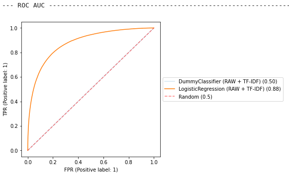

---
## Modèle sur mesure avancé

Nous avons ensuite exploré les possibilités des réseaux de neurones récurrents.

Pour ce faire, nous avons procédé étape par étape:

>### 1. recherche du **pré-processing**
> Chacun des 8 datasets pré-processés a été traité pour obtenir des séquences d'index au lieu de séquences de mots, puis ils ont été évalués avec un modèle RNN commun.
>
> **Conclusions** : là encore, les pré-processing ne supprimant PAS les stop-words ont donné les meilleurs résultats.
>
> Mais cette fois c'est `PREPROCESS04_nofilter` consistant en un nettoyage rudimentaire *(celui de la tokenization)*, suivi d'une lemmatization, qui s'est imposé.

 

>### 2. recherche du **plongement de mots**
>> Le plongement de mots est une représentation des mots sous forme de vecteurs qui codent leur signification contextuelle, de sorte que les mots qui sont proches dans l'espace vectoriel sont censés avoir une signification similaire. Ainsi les mots `Femme` et `Homme` sont encodés de sorte que si l'on fait `Roi` - `Homme` + `Femme`, on devrait obtenir le vecteur de `Reine`. Cette approche permet également de distinguer des mots identiques qui s'utilisent dans des contextes différents.
>
> On a testé:
> - des modèles bag-of-words / bag-of-ngrams *(sans embedding)*
> - des modèles séquentiels *(avec embedding `Word2Vec`, `FastText`, `GloVe`, `GloVe-Twitter` ou `Keras`)*
>
> **Conclusions** : les modèles bag-of-bigrams *(one-hot-encoded, tf-idf ou count)* ont donné de bons résultats, mais subissent rapidement un problème de dimentionnalité en lien avec la taille du vocabulaire.
>
> Les modèles séquentiels obtiennent les meilleurs résultats, mais c'est très variable d'un embedding à l'autre; les modèles les plus génériques comme le `Word2Vec300_GoogleNews` ou le `FastText300` ont donnés des résultats très honorables sans pour autant surpasser notre meilleur modèle bag-of-bigrams. De même, le `Glove-100d` n'a pas brillé sur notre dataset, mais les GloVe entraînés sur des corpus Twitter ont donné d'excellents résultats.
>
> C'est d'ailleurs l'embedding `GloveTwitter 200d` qui a été retenu.

 

>### 3. recherche de **l'architecture**
>
> Nous avons préparé 11 architectures basées sur des couches `SimpleRNN`, `LSTM` ou `GRU` avec diverses variantes *(`bidirectionnel`, 32 ou 64 units...)*
>
>> Les **RNN** *(réseaux neuronaux dont au moins un neurone boucle vers sa propre couche ou une couche précédente)* tels que les *SimpleRNN*, les *LSTM* ou les *GRU*, sont crées pour traiter des séquences en essayant de faire persister l'information.
>
> **Conclusions** : les architectures avec des couches *LSTM* et *GRU* *(qui se valent dans l'ensemble)* surpassent les architectures plus simples, les architectures bi-directionnelles surpassent les uni-directionnelles, et enfin plus on a d’unités d'activation et plus ça semble bénéfique.
>
> C'est donc `l'architecture la plus complexe qui a donné les meilleurs résultats`, mais les différences entre toutes les architectures *LSTM* et *GRU* sont assez faibles *(moins de 2%)* et ces tendances pourraient être tout autre avec un autre dataset.

Voici les résultats du meilleur modèle RNN:

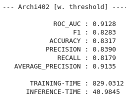
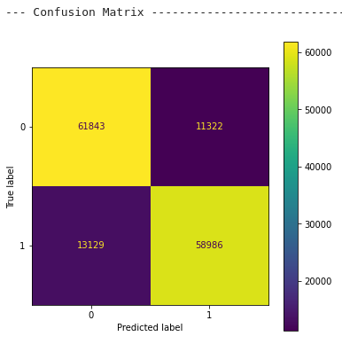
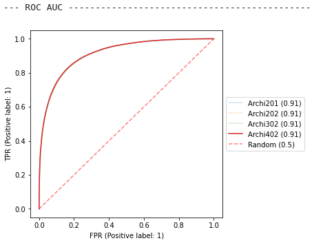

---
## Modèle avancé BERT

Enfin, nous avons exploré les possibilités offertes par les transformers et en particulier les modèles BERT *(Bidirectional Encoder Representations from Transformers)*.

> BERT est une technique d'apprentissage **NLP** basée sur les **transformers**.
>
> Un Transformer est un modèle de réseau neuronal de type seq2seq qui a la particularité d'utiliser un mécanisme d'attention au lieu de réseau récurrent ou convolutionnel pour conserver l'interdépendance des mots d'une séquence.

Nous avons donc essayé des modèles BERT sans et avec fine-tuning.

L'utilisation des modèles pré-entrainés sans fine-tuning est facile, mais à moins de choisir une variante correspondant vraiment à notre dataset, les performances restent en dessous de celles obtenus avec notre meilleur RNN.

En revanche, après fine-tuning on obtient **des performances intéressantes**; notre modèle dépassant de 3+% les meilleurs scores d'Accuracy ou ROC-AUC obtenus.

Mais ce gain se paie le prix fort avec **un temps d’entraînement particulièrement long** et la **quasi-nécessité d'avoir accès à des GPUs**.

Nous pourrions donc probablement améliorer le modèle en lui fournissant davantage d'exemples, mais il faudra en payer le prix en temps *(et donc en argent)*.

Voici les résultats du meilleur modèle BERT:

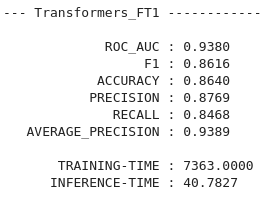
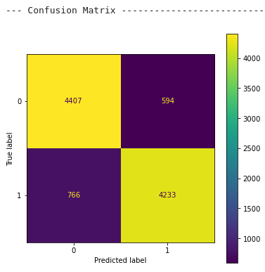
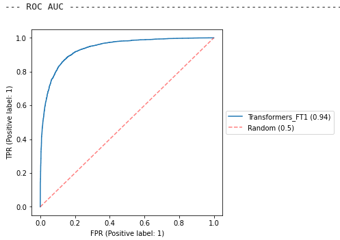

---
## Conclusions

<table>
    <tr>
        <th>Method</th>
        <th>ROC AUC</th>
        <th>Accuracy</th>
        <th>Training-time</th>
        <th>Inference-time</th>
        <th>Total samples</th>
    </tr>
    <tr>
        <th>DummyClassifier (RAW + TF-IDF)</th>
        <td>0.501126</td>
        <td>0.501144</td>
        <td>2.180013</td>
        <td>0.026919</td>
        <td>1452791</td>
    </tr>
    <tr>
        <th>LogisticRegression (RAW + TF-IDF)</th>
        <td>0.878261</td>
        <td>0.797955</td>
        <td>1104.552671</td>
        <td>0.031679</td>
        <td>1452791</td>
    </tr>
    <tr>
        <th>RNN Archi-402 (lemmas_not_filtered + TextVectorization[int])</th>
        <td>0.912817</td>
        <td>0.831697</td>
        <td>829.031158</td>
        <td>40.984504</td>
        <td>1452791</td>
    </tr>
    <tr>
        <th>Transformers Fine-Tuning_1 (RAW + AutoTokenizer)</th>
        <td>0.937993</td>
        <td>0.864</td>
        <td>7363.0</td>
        <td>40.7827</td>
        <td>100000</td>
    </tr>
</table>

Dans notre cas, l'évolution des performances s'est faite de paire avec l'évolution en complexité de nos modèles.

Le modèle *roberta-base* avec fine-tuning nous donne donc les meilleurs résultats. Mais comme il demande de grosses ressources, nous avons choisi de déployer notre meilleur modèle RNN, qui malgré des performances légèrement moindres a l'avantage d'être ré-entraînable dans un laps de temps plus raisonnable et de ne pas avoir besoin de GPU pour fonctionner *(il est d'ailleurs déployé sans GPU sur Heroku)*.