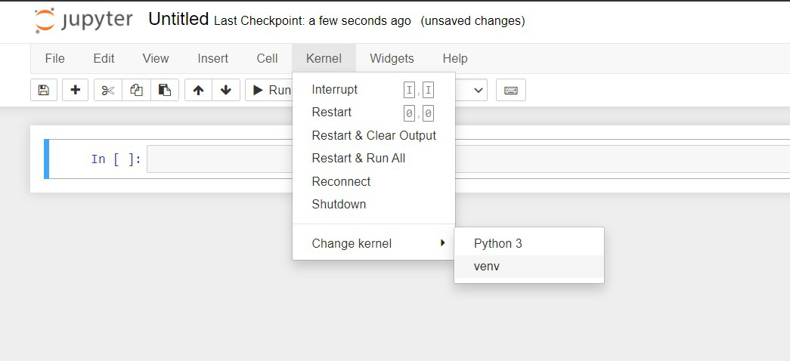

# Sentiment Analysis
## ("Détectez les Bad Buzz grâce au Deep Learning")

[This project is part of the AI Engineer cursus on OpenClassrooms]

We are provided with a dataset called [Sentiment 140](https://s3-eu-west-1.amazonaws.com/static.oc-static.com/prod/courses/files/AI+Engineer/Project+7%C2%A0-+D%C3%A9tectez+les+Bad+Buzz+gr%C3%A2ce+au+Deep+Learning/sentiment140.zip) containing **1,600,000 tweets** extracted using the twitter api.


>#### The purpose of this project is to train on sentiment analysis with various models:
> - **simple & classic models** such as LogisticRegression,
> - **neural network models** such as RNN,
> - **transformers models** such as BERT,


1. At first, we will conduce an EDA *(01_EDA.ipynb)* in order to better understand the dataset and prepare some pre-processed datasets.
2. Then we will search for a baseline with a DummyClassifier and a LogisticRegression *(02_Classification_classique.ipynb)*
3. After that, we will try to find the best Neural Network configuration
    * Search for the best pre-processing *(03_Classification_NN_Select_PreProcessing.ipynb)*
    * Search for the best embedding *(04_Classification_NN_Select_Embedding.ipynb)*
    * Search for the best architecture *(05_Classification_NN_Select_Architecture.ipynb)*
4. Next, we will try some Transformers models *(06_Classification_Transformers.ipynb)*
5. Finally, we will develop a python script to expose the selected model with an API *(API_server.py)*

---


## Running the notebooks online

As the notebooks use hyperlinks for the navigation, and because this doesn't work on GitHub, they are also avaible on [nbviewer.org](https://nbviewer.org/github/Valkea/OC_AI_07/tree/main/) for convenience.


## Running the notebook locally

In order to use this project locally, you will need to have Python and Jupyter notebook installed.
Once done, we can set the environment by using the following commands:


### First, 
let's duplicate the project github repository

```bash
>>> git clone https://github.com/Valkea/OC_AI_07
>>> cd OC_AI_07
```


### Secondly,
let's clone the large file with DVC *(you need to install [DVC](https://dvc.org) prior to using the following command line)*:
```bash
>>> dvc remote add origin https://dagshub.com/Valkea/OC_AI_07.dvc
>>> dvc pull -r origin
```


### Thirdly,
let's create a virtual environment and install the required Python libraries

(Linux or Mac)
```bash
>>> python3 -m venv venvP7
>>> source venvP7/bin/activate
>>> pip install -r requirements.txt
```

(Windows):
```bash
>>> py -m venv venvP7
>>> .\venvP7\Scripts\activate
>>> py -m pip install -r requirements.txt
```


### Finally,
let's configure and run the virtual environment for Jupyter notebook


#### Install jupyter kernel for the virtual environment using the following command:

```bash
>>> pip install ipykernel
>>> python -m ipykernel install --user --name=venvP7
```


#### Install specific tools that aren't installed using the requirements.txt file

REQUIRED: let's install the spacy model used in this project
```bash
>>> python -m spacy download en_core_web_sm
```


#### Select the installed kernel

In order to run the various notebooks, you will need to use the virtual environnement created above.
So once the notebooks are opened (see below), prior to running it, follow this step:



#### Run the jupyter notebooks

1. in order to see the notebooks, run:
```bash
>>> jupyter lab
or
>>> jupyter Notebook_Name.ipynb
```


## Running API server locally using python scripts
Start Flask development server:
```bash
(venv) >> python API_server.py
```

Stop with CTRL+C *(once the tests are done, from another terminal...)*


#### Tests
One can check that the server is running by opening the following url:
http://0.0.0.0:5000/

Then by submitting various texts, you should get various predictions. You can post data with a software such as Postman, or even using curl as belows:
```bash
curl -X POST -H "Content-Type: text/plain" --data "I love this" http://0.0.0.0:5000/predict
```

Note that the first request might take some time. But once you've got the first prediction, it should run pretty fast for the others.


## Docker

### Building a Docker image

```bash
>> docker build -t tweet-sentiment-classification .
```

### Running a local Docker image

```bash
>> docker run -it -p 5000:5000 tweet-sentiment-classification:latest
```

Then one can run the same test steps as before with curl.

Stop with CTRL+C


### Pulling a Docker image from Docker-Hub

I pushed a copy of my docker image on the Docker-hub, so one can pull it:

```bash
>> docker pull valkea/tweet-sentiment-classification:latest
```

But this command is optionnal, as running it (see below) will pull it if required.

### Running a Docker image gathered from Docker-Hub

Then the command to start the docker is almost similar to the previous one:

```bash
>> docker run -it -p 5000:5000 valkea/tweet-sentiment-classification:latest
```

And once again, one can run the same curve's tests.

Stop with CTRL+C


## Cloud deployement

In order to deploy this project, I decided to use Heroku.

*Here is a great ressource to help deploying projects on Heroku:*
https://github.com/nindate/ml-zoomcamp-exercises/blob/main/how-to-use-heroku.md

So if you don't already have an account, you need to create one and to follow the process explained here: https://devcenter.heroku.com/articles/heroku-cli


#### Create project on Heroku

Once the Heroku CLI is configured, one can login and create a project using the following commands (or their website):

```bash
>> heroku login
>> heroku create twitter-sentiment-clf
```


#### Push project to Heroku

Then, the project can be compiled, published and ran on Heroku, with:

```bash
>> heroku container:login
>> heroku container:push web -a twitter-sentiment-clf
>> heroku container:release web -a twitter-sentiment-clf
```


#### Test project from Heroku's cloud instance
```bash
curl -X POST -H "Content-Type: text/plain" --data "I love this" https://twitter-sentiment-clf.herokuapp.com/predict
```
This should return an "The predicted label is **POSITIVE** with the following probability: 92.48%".

The heroku container might take some time to start if it is asleep.


#### Uninstalling the venv kernel
Once done with the project, the kernel can be listed and removed using the following commands:

```bash
>>> jupyter kernelspec list
>>> jupyter kernelspec uninstall venvP7
```